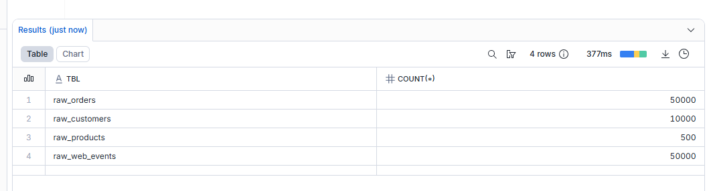
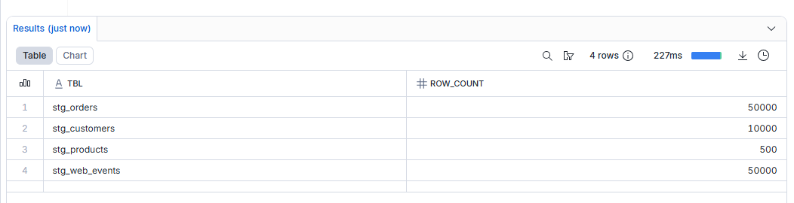
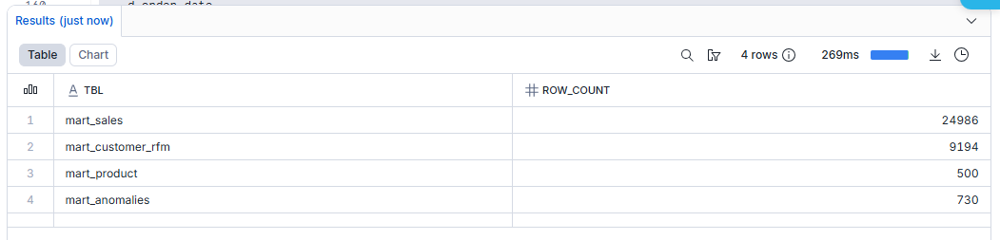
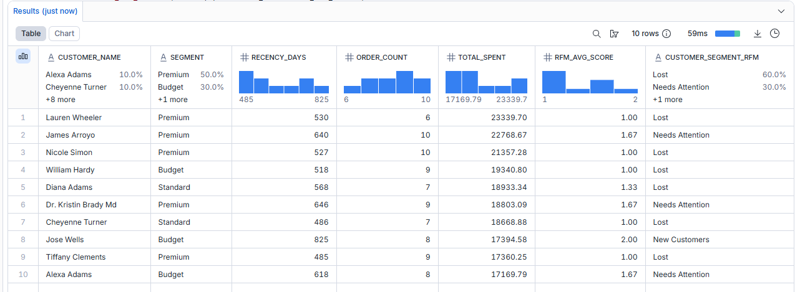
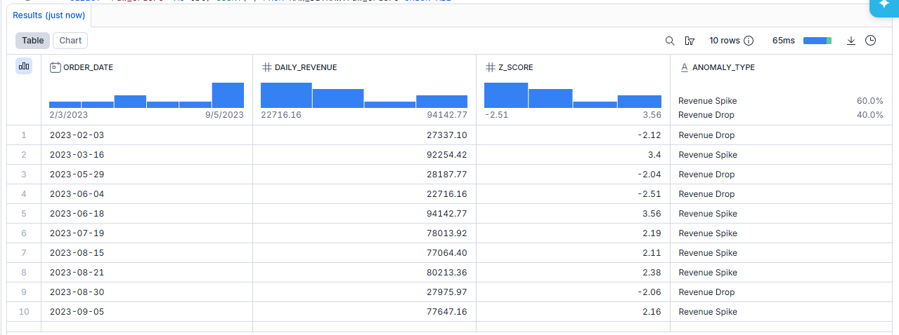
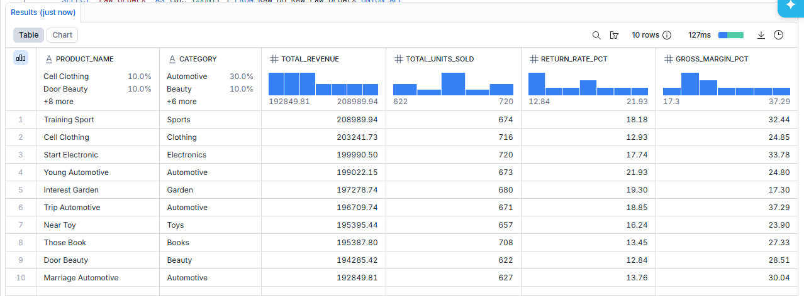

# 🏪 Retail Intelligence Platform
### End-to-End ELT Data Pipeline on Snowflake

A production-grade data engineering project that ingests raw e-commerce data, 
transforms it through a 3-layer medallion architecture, and delivers 
business-ready analytics including RFM customer segmentation and 
statistical anomaly detection.

---

## 🏗️ Architecture
Raw Sources → Python Ingestion → RAW Layer → SQL Transforms → STAGING Layer → SQL Aggregations → MARTS Layer → BI Tools

**Medallion Architecture — 3 databases in Snowflake:**
- `RAW_DB` — Exact copy of source data, never modified
- `STAGING_DB` — Cleaned, cast, deduplicated with business logic
- `MARTS_DB` — Analytics-ready tables for BI consumption

---

## 📊 Data Sources

| Source | Format | Volume |
|--------|--------|--------|
| Orders | CSV | 50,000 rows |
| Customers | CSV | 10,000 rows |
| Products | JSON | 500 rows |
| Web Events | JSON | 50,000 rows |

---

## 🔧 Tech Stack

- **Cloud Data Warehouse:** Snowflake
- **Ingestion:** Python (snowflake-connector-python, PUT + COPY INTO)
- **Transformation:** SQL (window functions, CTEs, QUALIFY)
- **Orchestration:** Snowflake Tasks (CRON scheduling)
- **Data Generation:** Python (Faker library)

---

## 📁 Project Structure
```
retail-intelligence-platform/
├── generate_data.py        # Generates synthetic e-commerce data
├── ingest.py               # Loads data into Snowflake RAW layer
├── sql/
│   ├── setup_snowflake.sql # Creates databases, schemas, warehouses
│   ├── staging.sql         # Cleaning and transformation layer
│   ├── marts.sql           # Business analytics marts
│   └── tasks.sql           # Automated scheduling
└── screenshots/            # Query results and proof of execution
```
---

## 🎯 Data Marts Built

### 1. `mart_sales` — 24,986 rows
Daily revenue aggregated by category, country, and order status.
Includes total revenue, AOV, gross profit margin, and discount rate.

### 2. `mart_customer_rfm` — 9,194 rows
RFM (Recency, Frequency, Monetary) scoring for every customer.
Classifies customers into segments: Champions, Loyal, At Risk, Lost, and more.
Uses `NTILE()` window functions to score customers 1-5 on each dimension.

### 3. `mart_product` — 500 rows
Product performance including total revenue, units sold, return rate,
gross margin %, and revenue rank within category.

### 4. `mart_anomalies` — 730 rows
Statistical anomaly detection on daily revenue using Z-score and IQR methods.
Flags Revenue Spikes and Revenue Drops automatically.

---

## 🚀 How to Run This Project

**Prerequisites:**
- Snowflake account (free trial at snowflake.com)
- Python 3.8+

**Install dependencies:**
```bash
pip install snowflake-connector-python faker
```

**Setup config.py with your Snowflake credentials:**
```python
SNOWFLAKE_CONFIG = {
    "account": "your_account",
    "user": "your_username",
    "password": "your_password",
    "warehouse": "RETAIL_WH",
    "database": "RAW_DB",
    "schema": "RAW",
    "role": "RETAIL_ANALYST",
}
```

**Run in this order:**
```bash
# 1. Run setup_snowflake.sql in Snowflake worksheet
# 2. Generate synthetic data
python generate_data.py

# 3. Load into Snowflake RAW layer
python ingest.py

# 4. Run staging.sql in Snowflake worksheet
# 5. Run marts.sql in Snowflake worksheet
# 6. Run tasks.sql in Snowflake worksheet
```

---

## 📸 Screenshots

### Raw Layer — Data Loaded


### Staging Layer — Data Cleaned


### Marts Layer — Business Analytics Ready


### RFM Customer Segmentation


### Anomaly Detection Results


### Top Products by Revenue


---

## 💡 Key SQL Concepts Used

- `QUALIFY` + `ROW_NUMBER()` for deduplication
- `NTILE()` window function for RFM scoring
- `TRY_TO_DATE`, `TRY_TO_DECIMAL` for safe type casting
- CTEs for readable multi-step transformations
- `CROSS JOIN` with aggregate stats for anomaly detection
- Snowflake `VARIANT` type for semi-structured JSON parsing

---

## 👩‍💻 Author
**Akanksha** — Aspiring Data Analyst
