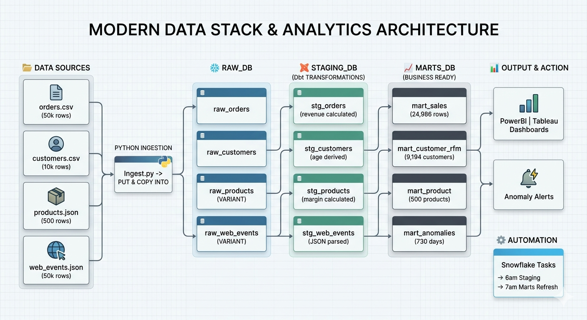

# Retail Intelligence Platform

An end-to-end data pipeline I built on Snowflake to understand how data 
actually moves in real companies, from raw messy files all the way to 
business-ready analytics.

I come from a SQL + Python background and wanted to go beyond basic 
pandas projects. So I picked Snowflake, learned medallion architecture, 
and built something that resembles what actual data teams work with.

---

## What this project does

Takes raw e-commerce data (orders, customers, products, web events) and 
runs it through a 3-layer pipeline that cleans it, models it, and answers 
real business questions like:

- Which customers are about to stop buying from us?
- Which products have the best margins?
- Were there any unusual revenue days this year?
- How much did we make per day, per category, per country?

Everything refreshes automatically every day via Snowflake Tasks. 
No manual running required once it's set up.

---

## The Architecture



---

## Data

I generated synthetic e-commerce data using Python's Faker library. 
Realistic enough to build proper business logic on top of.

| Table | Format | Rows |
|-------|--------|------|
| Orders | CSV | 50,000 |
| Customers | CSV | 10,000 |
| Products | JSON | 500 |
| Web Events | JSON | 50,000 |

Products and web events come in as JSON, stored as Snowflake VARIANT 
type and parsed using colon notation. First time I worked with 
semi-structured data inside a SQL warehouse and it was genuinely 
interesting.

---

## What I built in each layer

### RAW layer
Loads data exactly as received. No transformations. Ever.
This is intentional, if something breaks downstream, you can always 
go back to the original.

Also built a pipeline_run_log table that tracks every load with 
row counts, timestamps, and status. Useful for debugging.

### STAGING layer
This is where the actual SQL work happens:

- Fixed date formats using TRY_TO_DATE (safe casting, returns NULL 
  instead of erroring on bad data)
- Removed duplicates using QUALIFY + ROW_NUMBER() window function
- Calculated line revenue per order after discount
- Parsed JSON fields from VARIANT into typed columns
- Added derived columns like customer_age_days, stock_status, 
  is_discounted

### MARTS layer
Four tables that answer specific business questions:

**mart_sales**, Daily revenue by category, country, order status. 
Includes AOV, gross profit margin, discount rate. 24,986 rows.

**mart_customer_rfm**, RFM scoring for 9,194 customers.
Recency, Frequency, Monetary, each scored 1 to 5 using NTILE() 
window functions. Then classified into segments: Champions, Loyal 
Customers, At Risk, Lost, New Customers, Needs Attention.
This is what retention teams actually use to decide who to target 
with campaigns.

**mart_product**, Performance metrics for all 500 products.
Revenue, units sold, return rate, gross margin, and rank within 
category using RANK() window function.

**mart_anomalies**, 730 days of daily revenue with Z-score and IQR 
based anomaly detection. Flags Revenue Spikes and Revenue Drops 
automatically. In a real setup this would trigger alerts to the 
business team.

---

## The part that gave me the most trouble

Row-by-row Python inserts were timing out. 200,000 web events at 
1,000 rows per batch = way too many round trips to Snowflake. 
The connection kept dropping after a few hours.

Switched to PUT + COPY INTO, upload the whole file to an internal 
Snowflake stage, then load it in one shot. Went from hours to 
literally 10 seconds. That was a proper learning moment.

---

## Tech stack

- Snowflake, cloud data warehouse
- Python, data generation and ingestion
- SQL, all transformations and business logic
- Snowflake Tasks, CRON-based pipeline automation
- Faker, synthetic data generation
- snowflake-connector-python, Python to Snowflake connection

---

## How to run it yourself

You need a Snowflake account (free trial at snowflake.com) and Python 3.8+.

```bash
pip install snowflake-connector-python faker
```

Create a config.py with your credentials (this file is gitignored):

```python
SNOWFLAKE_CONFIG = {
    "account":   "your_account_identifier",
    "user":      "your_username",
    "password":  "your_password",
    "warehouse": "RETAIL_WH",
    "database":  "RAW_DB",
    "schema":    "RAW",
    "role":      "RETAIL_ANALYST",
}
```

Run in this order:

```bash
# Step 1, run sql/setup_snowflake.sql in Snowflake worksheet
# Step 2, generate the data
python generate_data.py
# Step 3, load into Snowflake
python ingest.py
# Step 4, run sql/staging.sql in Snowflake worksheet
# Step 5, run sql/marts.sql in Snowflake worksheet
# Step 6, run sql/tasks.sql in Snowflake worksheet
```

---

## A peek at the code

The part I'm most proud of — switching from row-by-row inserts 
to PUT + COPY INTO after the original approach kept timing out 
on 200k records. Went from 3 hours to 10 seconds.

```python
def load_json_via_stage(cursor, filepath: Path, table: str):
    """
    Uploads a JSON file to Snowflake internal stage,
    then loads it in one shot using COPY INTO.
    Much faster than row-by-row inserts for large files.
    """
    run_id = str(uuid.uuid4())
    log.info(f"Uploading {filepath.name} to stage...")

    # Upload entire file to Snowflake internal stage
    cursor.execute(
        f"PUT file://{filepath.absolute()} @fast_stage "
        f"AUTO_COMPRESS=TRUE OVERWRITE=TRUE"
    )

    # Load from stage into table in one operation
    cursor.execute(f"""
        COPY INTO {table} (raw_data, _source_file, _loaded_at, _run_id)
        FROM (
            SELECT $1, '{filepath}', CURRENT_TIMESTAMP(), '{run_id}'
            FROM @fast_stage/{filepath.name}.gz
        )
        FILE_FORMAT = (TYPE = 'JSON' STRIP_OUTER_ARRAY = TRUE)
        PURGE = TRUE
    """)

    cursor.execute(f"SELECT COUNT(*) FROM {table}")
    log.info(f"Done — {cursor.fetchone()[0]:,} rows loaded into {table}")
```

And the RFM scoring logic in SQL:

```sql
-- Score each customer 1-5 on Recency, Frequency, Monetary
-- NTILE splits customers into 5 equal buckets
-- Recency: lower days since last order = better score (ASC)
-- Frequency and Monetary: higher = better (DESC)

NTILE(5) OVER (
    ORDER BY DATEDIFF('day', last_order_date, CURRENT_DATE()) ASC
) AS recency_score,

NTILE(5) OVER (ORDER BY order_count DESC)  AS frequency_score,
NTILE(5) OVER (ORDER BY total_spent DESC)  AS monetary_score
```

## Screenshots

### Raw layer, data loaded into Snowflake


### Staging layer, cleaned and deduplicated


### Marts, business analytics ready


### RFM customer segmentation


### Anomaly detection results


### Top products by revenue


---

## Key SQL concepts used in this project

- QUALIFY + ROW_NUMBER() for deduplication without a subquery
- NTILE() for percentile-based RFM scoring
- TRY_TO_DATE, TRY_TO_DECIMAL for safe type casting
- CTEs to break complex logic into readable steps
- CROSS JOIN with aggregated stats for anomaly thresholds
- Snowflake VARIANT type with colon notation for JSON parsing
- PERCENTILE_CONT for IQR calculation

---

## About

**Akanksha Singh**, Data Analyst
